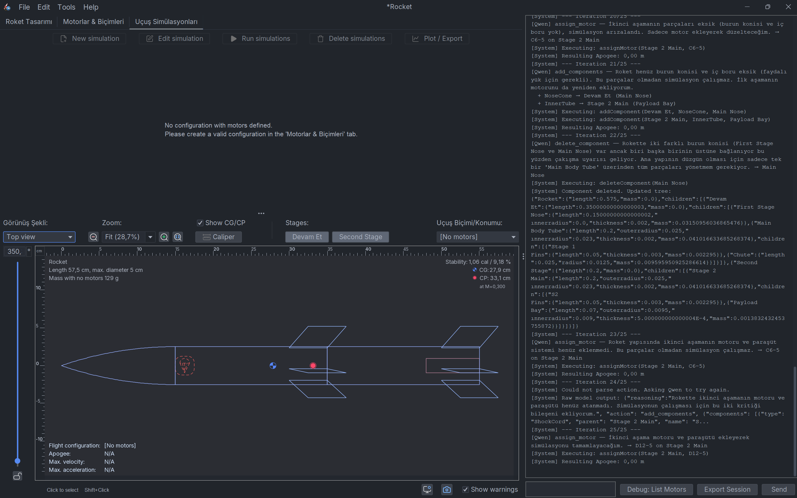

# 🚀LlamaRocket

**QwenRocket** (formerly known as LlamaRocket) is an AI-Enhanced fork of the OpenRocket simulator. It features an integrated AI Assistant powered by local LLMs (Qwen/Llama) to help you design, optimize, and simulate multi-stage rockets through natural language prompts.



## 🤖 AI Assistant Features
- **Natural Language Design**: Describe your rocket (e.g., "Build a 2-stage rocket with a 250m apogee and 400g payload") and the AI will construct the component tree.
- **Smart Component Management**: Add and manage Transitions, Parachutes, Shock Cords, Nose Cones, Inner Tubes, and more directly through chat.
- **Auto-Optimization**: The AI automatically runs simulations, identifies issues (e.g., missing motors, unstable designs), and adjusts parameters to achieve target goals.
- **Dynamic Motor Injection**: Selects and assigns real motors from your local database based on simulation requirements.
- **Local & Private**: Powered locally via Ollama, ensuring your prompt data and designs never leave your computer.

---

## 📋 Yol Haritası / Yapılacaklar Listesi (To-Do List)

Aşağıda projenin mevcut durumu ve gelecekte eklenecek özelliklerin bir listesi bulunmaktadır:

- [x] **Temel AI Entegrasyonu:** OpenRocket UI içine Qwen/Llama sohbet panelinin (Qwen Assistant Panel) eklenmesi.
- [x] **Parça Ekleme/Çıkarma:** Promptlar aracılığıyla roket ağacına (component tree) müdahale.
- [x] **Motor Atama:** Yapay zekanın roket aşamalarına uygun motorları seçip simülasyonu otomatik çalıştırması.
- [x] **Hata Yakalama (Debug & Self-Correction):** Yanlış motor seçimi veya geçersiz isimlerde sistemin hatayı tespit edip, AI'ın döngü içinde kendi kendini düzeltmesi.
- [x] **Çoklu Dil Desteği:** Asistanın JSON formatlama şablonlarına dil kurallarının gömülmesiyle, kullanıcının komut diline (örneğin tamamen Türkçe) kusursuz adapte olması.
- [x] **Otonom Test ve Raporlama (Anti-Loop):** Ulaşılamaz sayısal hedeflerde (örn. tam 500m apogee) yapay zekanın sonsuz motor deneme döngüsüne girmeyip, durumu analiz edip mantıklı raporlar ve yapısal değişiklik önerileri sunması.
- [ ] **Gelişmiş Optimizasyon:** Ağırlık merkezi (CG) ve basınç merkezi (CP) optimizasyonu için AI destekli otonom aerodinamik düzeltmeler (kütle ekleme, kanat kırpma, gövde boyu değiştirme).
- [ ] **Özelleştirilmiş LLM Modelleri:** Roket bilimi ve aerodinamik için özel fine-tune edilmiş hafif lokal modellerin (LoRA) entegrasyonu.

### 🌟 Son Güncellemeler (Bugünün Başarıları)
- **Akıllı Döngü Yönetimi:** Local AI modellerin takılıp kalma sorununu aşan `Anti-Loop` kuralı başarıyla entegre edildi.
- **Sadece-Okunur (Read-Only) Mod Desteği:** Kullanıcı sadece "analiz et", "incele" gibi komutlar verdiğinde roket mimarisine hiçbir şekilde dokunmadan sadece durum tespiti yapabilen ve bunu Türkçe özetleyen stabil bir yapı kuruldu.
- **Modern Arayüz ve Gemma Entegrasyonu:** Asistan arayüzünün (UI) fontları modernize edildi (Segoe UI) ve varsayılan yapay zeka modeli olarak `Gemma` modellerini otomatik tanıyacak şekilde ayarlandı.

---

## 🛠️ Kurulum & Kullanım (Getting Started)

1. **Ollama Kurulumu:** Bilgisayarınıza [Ollama](https://ollama.com) kurun ve `qwen` veya uygun bir model indirin (`ollama run qwen`).
2. **Projeyi Derleyin:** 
   ```bash
   ./gradlew build
   ```
3. **Çalıştırın:**
   ```bash
   ./gradlew swing:run
   ```
4. **AI Asistanı Kullanın:** Sağ panelde açılan sekmeden roketiniz hakkında komutlar vermeye başlayın. (Örn: "Birinci aşamaya C6-5 motoru ekle ve simülasyonu çalıştır.")

## 📜 Lisans
OpenRocket is proudly open-source under the [GNU GPL](https://www.gnu.org/licenses/gpl-3.0.en.html) license. 
